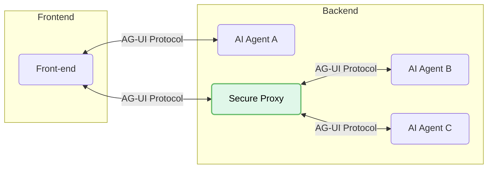

**AG-UI** standardizes how **front-end applications connect to AI agents**
through an open protocol. Think of it as a universal translator for AI-driven
systems- no matter what language an agent speaks: **AG-UI ensures fluent
communication**.

## Why AG-UI?

AG-UI helps developers build next-generation AI workflows that need **real-time
interactivity**, **live state streaming** and **human-in-the-loop
collaboration**.

AG-UI provides:

- **A straightforward approach** to integrating AI agents with the front-end
  through frameworks such as
  [CopilotKit 🪁](https://github.com/CopilotKit/CopilotKit)
- **Building blocks** for an efficient wire protocol for human⚡️agent
  communication
- **Best practices** for chat, streaming state updates, human-in-the-loop and
  shared state

### Architecture

At its core, AG-UI bridges AI agents and front-end applications using a
lightweight, event-driven protocol:

- **Front-end**: The application (chat or any AI-enabled app) that communicates
  over AG-UI
- **AI Agent A**: An agent that the front-end can connect to directly without
  going through the proxy
- **Secure Proxy**: An intermediary proxy that securely routes requests from the
  front-end to multiple AI agents
- **Agents B and C**: Agents managed by the proxy service

## Quick Start

Choose the path that fits your needs:

<CardGroup cols={2}>
  <Card
    title="Build with AG-UI"
    icon="wrench"
    href="/quickstart/build"
    color="#3B82F6"
    iconType="solid"
  >
    Implement AG-UI events directly in your agent framework
  </Card>
  <Card
    title="Connect to AG-UI"
    icon="bolt"
    href="/quickstart/connect"
    color="#3B82F6"
    iconType="solid"
  >
    Connect AG-UI with existing protocols or custom solutions
  </Card>
</CardGroup>

## Resources

Explore guides, tools, and integrations to help you build, optimize, and extend
your AG-UI implementation. These resources cover everything from practical
development workflows to debugging techniques.

<CardGroup cols={2}>
  <Card
    title="Explore Integrations"
    icon="cubes"
    iconType="light"
    color="#3B82F6"
    href="/integrations"
  >
    Discover ready-to-use AG-UI integrations across popular agent frameworks and
    platforms
  </Card>
  <Card
    title="Developing with Cursor"
    icon="rocket"
    iconType="light"
    color="#3B82F6"
    href="/tutorials/cursor"
  >
    Use Cursor to build AG-UI implementations faster
  </Card>
  <Card
    title="Troubleshooting AG-UI"
    icon="bug"
    iconType="light"
    color="#3B82F6"
    href="/tutorials/debugging"
  >
    Fix common issues when working with AG-UI servers and clients
  </Card>
</CardGroup>

## Explore AG-UI

Dive deeper into AG-UI's core concepts and capabilities:

<CardGroup cols={2}>
  <Card
    title="Core architecture"
    icon="sitemap"
    iconType="light"
    color="#3B82F6"
    href="/docs/concepts/architecture"
  >
    Understand how AG-UI connects agents, protocols, and front-ends
  </Card>
  {/* <Card title="Resources" icon="database" href="/docs/concepts/resources">
    Expose data and content from your servers to LLMs
  </Card>
  <Card title="Prompts" icon="message" href="/docs/concepts/prompts">
    Create reusable prompt templates and workflows
  </Card>
  <Card title="Tools" icon="wrench" href="/docs/concepts/tools">
    Enable LLMs to perform actions through your server
  </Card>
  <Card title="Sampling" icon="robot" href="/docs/concepts/sampling">
    Let your servers request completions from LLMs
  </Card> */}
  <Card
    title="Transports"
    icon="network-wired"
    iconType="light"
    color="#3B82F6"
    href="/docs/concepts/transports"
  >
    Learn about AG-UI's communication mechanism
  </Card>
</CardGroup>

## Contributing

Want to contribute? Check out our
[Contributing Guide](/development/contributing) to learn how you can help
improve AG-UI.

## Support and Feedback

Here's how to get help or provide feedback:

- For bug reports and feature requests related to the AG-UI specification, SDKs,
  or documentation (open source), please
  [create a GitHub issue](https://github.com/ag-ui-protocol)
- For discussions or Q&A about the AG-UI specification, use the
  [specification discussions](https://github.com/ag-ui-protocol/specification/discussions)
- For discussions or Q&A about other AG-UI open source components, use the
  [organization discussions](https://github.com/orgs/ag-ui-protocol/discussions)
